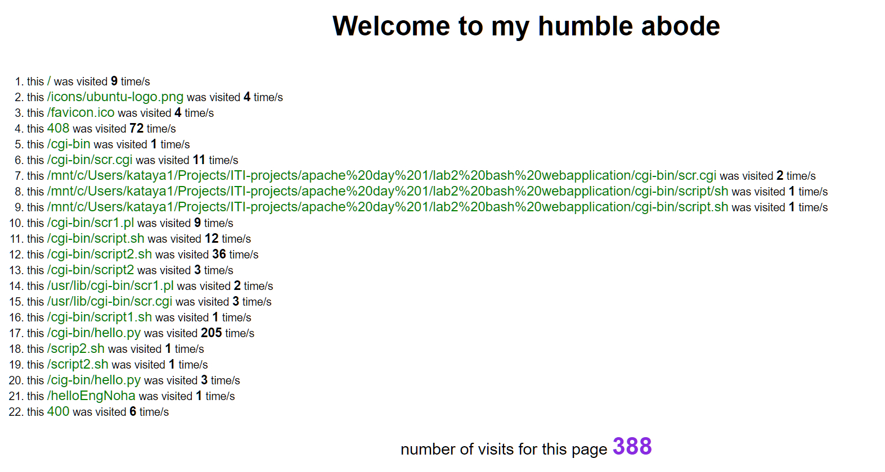

# apache page popularity 

lists all the paths that got accessed on the website and the number of times it got accessed

---

get started with apache cgi programming https://code-maven.com/set-up-cgi-with-apache

- run apache2
- put the files in cgi-bin directory   
- make a hard link of apache's acces.log file inn current directory 
- access it on uri http://localhost/cgi-bin/hello.py
- access any other path and check that it appears  
